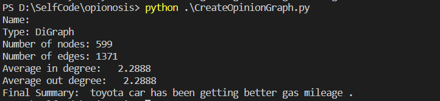

# Opinosis
### Introduction
Opinosis is a graph based approach to generate abstractive summaries of highly redundant opinion. More details can be found at http://timan.cs.uiuc.edu/downloads.html.  
The original idea was presented by ***Kavita Ganesan, ChengXiang Zhai, JiaweiHan (University of Illinois @ Urbana Champaign)*** under the topic **Opinosis**. Please refer to the [paper](./opinosis.pdf) and [presentation](./opinosis-presentation.ppt.pdf) for more details.  
 
 

### Example
An example of running the algorithm on a small dataset of Toyota Camry reviews  

### Steps
1.) Run the command ***python CreateOpinionGraph.py***
